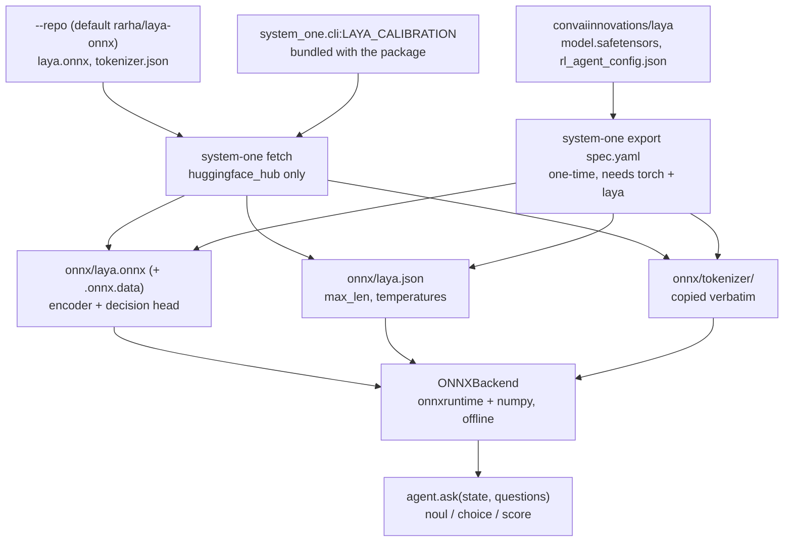

# Running a local model

The `onnx` backend runs a decision model in-process — no network, no API key,
no torch at runtime. The weights it needs come from
[laya](https://github.com/receptron/laya), an open-source System One model
published by Convai Innovations at
[`convaiinnovations/laya`](https://huggingface.co/convaiinnovations/laya).

There are two ways to get the artifacts: download the already-exported graph
(`system-one fetch`, minutes, no torch), or export a checkpoint yourself
(`system-one export`, needs torch and roughly twenty minutes of tracing). Both
write the same three-file layout, which you then point `SYSTEM_ONE_ONNX_DIR` at.



## 1. Fetch the ready graph (the fast path)

```shell
pip install "system-one[onnx,hub]"
system-one fetch --out-dir onnx
```

That pulls the exported english/root graph from
[`rarha/laya-onnx`](https://huggingface.co/rarha/laya-onnx) and writes:

```
onnx/
├── laya.onnx       # the graph
├── laya.onnx.data  # external weights, ≈1.6 GB fp32
├── laya.json       # calibration: max_len, head_max_len, temperatures
└── tokenizer/
    └── tokenizer.json
```

| Flag | Default | What it does |
| --- | --- | --- |
| `--variant` | `fp32` | `fp32`; `int8` and `fp16` exist only in repos that publish them |
| `--out-dir` / `-o` | `onnx` | where to write — must match `SYSTEM_ONE_ONNX_DIR` |
| `--revision` | `main` | pin the repo to a commit or tag |
| `--repo` | `rarha/laya-onnx` | any repo with the same flat layout (`laya.onnx`, `laya.onnx.data`, `tokenizer.json`) |

The output base name is always `laya`: the fp32 and fp16 graphs reference their
external-data file by name from inside the ONNX proto, so renaming would take
graph surgery. Use a separate `--out-dir` per variant instead.

`laya.json` is not downloaded — the calibration is `LAYA_CALIBRATION` in
`system_one/cli.py`, laya's root checkpoint values (`max_len`, `head_max_len`,
the three temperatures and the per-option table). A different checkpoint has
different temperatures, so a `--repo` holding some other conversion needs its
`laya.json` replaced by hand or written by `system-one export`.

Only the `english` checkpoint is published as ONNX. For `multilingual` or
`typed-decisions`, export them yourself.

!!! warning "`--repo Mattepiu/laya-onnx` takes two options at most"
    The other published conversion,
    [`Mattepiu/laya-onnx`](https://huggingface.co/Mattepiu/laya-onnx), was
    traced with the option count frozen at 2 — it declares
    `marker_pos [batch, 2]` and reshapes to it internally, so a choice or score
    question with three or more criteria fails with `Got invalid dimensions for
    input: marker_pos`. It does carry `int8` and `fp16` variants, which are
    quantisations of that same trace. The default repo has no such ceiling.

## 2. Or export a checkpoint yourself

An export of your own has no option-count ceiling: the `options` dimension is
traced as dynamic.

```shell
uv sync --all-extras --group dev   # dev carries laya, and through it torch
uv run system-one export examples/export/laya-english.yaml -o onnx
```

The spec is YAML or JSON and describes where the checkpoint lives and how to
build it:

```yaml
name: laya-multi
repo: convaiinnovations/laya
subfolder: multilingual
```

| Field | Default | What it is |
| --- | --- | --- |
| `name` | — | output base name: `<name>.onnx`, `<name>.json`. Must match `SYSTEM_ONE_MODEL` |
| `repo` | — | Hugging Face repo id. Exactly one of `repo` / `path` |
| `path` | — | local checkpoint directory instead of a download |
| `revision` | `main` | pin the checkpoint repo |
| `subfolder` | `""` | checkpoint subdirectory inside the repo |
| `builder` | `system_one.export:build_laya` | `module:function`, called as `builder(config, model_dir) -> torch.nn.Module` |
| `config_file` | `rl_agent_config.json` | model config, read for the calibration keys |
| `weights` | `model.safetensors` | state dict, loaded with `strict=True` |
| `tokenizer_dir` | `tokenizer` | copied verbatim next to the graph |
| `patterns` | derived | HF `allow_patterns`; defaults to the files above under `subfolder` |
| `calibration` | `max_len`, `head_max_len`, `temperature`, `temperature_by_options` | keys copied into `<name>.json` |
| `opset` | `18` | ONNX opset |

`examples/export/` holds the three laya checkpoints — `laya-english.yaml`,
`laya-multilingual.yaml`, `laya-typed-decisions.yaml` — plus
`custom-model.json`, a local `path` with a third-party `builder`.

The graph signature is not configurable: five inputs (`input_ids`,
`attention_mask`, `marker_pos`, `marker_mask`, `qtype`) and two outputs
(`logits`, `act_probs`) are the contract the backend decodes. A model with a
different signature needs a different backend, not a different spec.

The export finishes by printing parity against the torch reference on the trace
inputs — expect `max |dlogits|` around `1e-4` or below.

!!! note
    `name` is a file base name, not a model identity — it is what
    `SYSTEM_ONE_MODEL` has to say and what comes back as `response.model`.
    `SYSTEM_ONE_MODEL` itself still defaults to `jev-latest`, the hosted
    provider's model, so a local run has to set it.

The variants are laya's three checkpoints: `english` (ModernBERT-large, 421M
params), `multilingual` (mmBERT-base, 322M params, 100+ languages and roughly
twice as fast) and `typed-decisions` (ModernBERT-large fine-tuned on typed
workflows).

## 3. Point the SDK at it

```shell
SYSTEM_ONE_BACKEND=onnx
SYSTEM_ONE_ONNX_DIR=onnx   # default
SYSTEM_ONE_MODEL=laya      # the spec's `name`, or `laya` after a fetch
```

```python
from system_one import SystemOne

with SystemOne("onnx", model="laya") as agent:
    response = agent.ask(
        "Our production deployment failed after the upgrade.",
        {
            "outage": {"type": "noul", "instructions": "Is there an outage?"},
            "team": {
                "type": "choice",
                "instructions": "Which team?",
                "criteria": ["billing", "support", "sales"],
            },
        },
    )

print(response.nouls["outage"].noul)
print(response.choices["team"].choice, response.choices["team"].probabilities)
```

No API key is read, and nothing leaves the machine. Everything else — question
types, answer shapes, the async agent — is identical to the HTTP backend.

## Several models in one directory

Give each spec its own `name` and export into the same directory:

```shell
uv run system-one export examples/export/laya-english.yaml -o onnx
uv run system-one export examples/export/laya-multilingual.yaml -o onnx
```

Then pick per call — sessions are cached per `(directory, model)` pair, so both
stay loaded and neither is re-read from disk:

```python
agent.ask(state, questions, model="laya-multi")
```

Fetched variants cannot share a directory (they are all named `laya`); give
each one its own `--out-dir` and switch with `SYSTEM_ONE_ONNX_DIR`.

## Verifying the artifacts

`scripts/check_onnx_parity.py` runs the graph and the reference `laya`
implementation over the same realistic questions — long states, 18-option
choices, JSON states — and reports the largest divergence in the final
probabilities:

```shell
uv run scripts/check_onnx_parity.py onnx --model laya
```

The local test suite covers the same ground and skips itself when the artifacts
are absent. It reads `SYSTEM_ONE_ONNX_DIR` and `SYSTEM_ONE_MODEL`, defaulting to
`onnx/laya.onnx`:

```shell
uv run pytest tests/backends/test_onnx_local.py
SYSTEM_ONE_MODEL=laya-multi uv run pytest tests/backends/test_onnx_local.py
```

## Troubleshooting

| Symptom | Cause |
| --- | --- |
| `SystemOneError: No ONNX graph at …` | `SYSTEM_ONE_ONNX_DIR` / `SYSTEM_ONE_MODEL` do not match the written file names. |
| `ImportError` naming a pip command | An extra is missing: `system-one[onnx]` to run, `[hub]` to fetch, `[export]` to export. |
| `SystemOneError: The tokenizer has no [MASK] token` | `tokenizer/` was not written next to the graph, or came from another model. |
| First `ask` is slow | The session loads ≈1.6 GB of weights once; it is then cached for the process. |

Moving the directory is fine — it holds no absolute paths. Copy `onnx/` to
another machine with the `onnx` extra installed and it runs there, offline.
