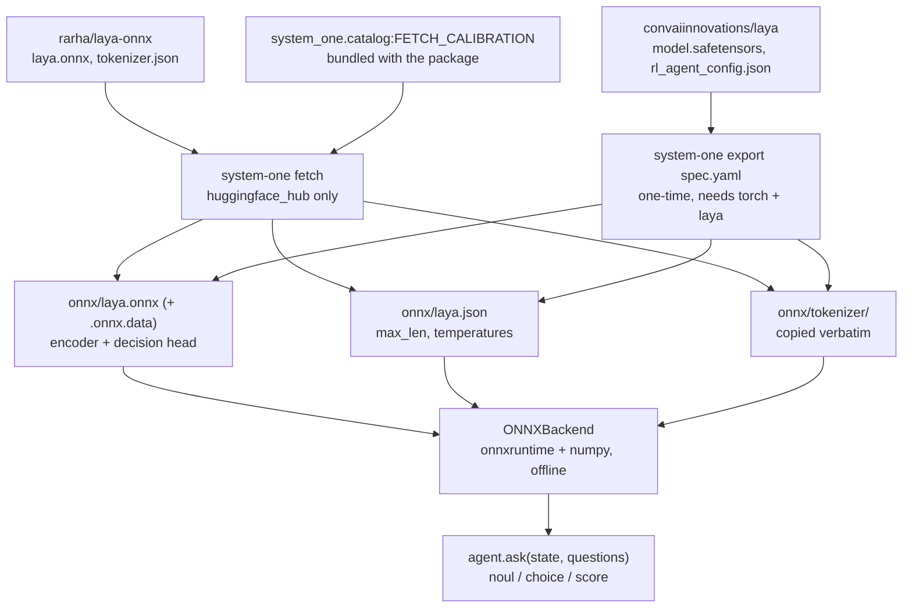

# Running a local model

The `onnx` backend runs a decision model in-process — no network, no API key,
no torch at runtime. The weights it needs come from
[laya](https://github.com/receptron/laya), an open-source System One model
published by Convai Innovations at
[`convaiinnovations/laya`](https://huggingface.co/convaiinnovations/laya).

There are two ways to get the artifacts: download the already-exported graph
(`system-one fetch`, minutes, no torch), or export a checkpoint yourself
(`system-one export`, needs torch and roughly twenty minutes of tracing). Both
write the same three-file layout, which you then point `SYSTEM_ONE_ONNX_DIR` at.



## 1. Fetch the ready graph (the fast path)

```shell
pip install "system-one[onnx,hub]"
system-one fetch --out-dir onnx
```

That pulls the exported english/root graph from
[`rarha/laya-onnx`](https://huggingface.co/rarha/laya-onnx) and writes:

```
onnx/
├── laya.onnx       # the graph
├── laya.onnx.data  # external weights, ≈1.6 GB fp32
├── laya.json       # calibration: max_len, head_max_len, temperatures + source
└── tokenizer/
    └── tokenizer.json
```

| Flag | Default | What it does |
| --- | --- | --- |
| `--variant` | `fp32` | `fp32`; `int8` and `fp16` exist only in repos that publish them |
| `--out-dir` / `-o` | `onnx` | where to write — must match `SYSTEM_ONE_ONNX_DIR` |
| `--revision` | `main` | pin the repo to a commit or tag |
| `--name` | `laya` | local base name: `<name>.onnx`, `<name>.json`. Must match `SYSTEM_ONE_MODEL` |

`--name` sets the local base name (default `laya`), but the fp32 and fp16 graphs
reference their external-data file by name from inside the ONNX proto, so renaming
those would take graph surgery — only `int8`, which has no sidecar, renames cleanly.
Use a separate `--out-dir` per variant.

`laya.json` is not downloaded — the calibration is `FETCH_CALIBRATION` in
`system_one/catalog.py`, laya's root checkpoint values (`max_len`, `head_max_len`,
the three temperatures and the per-option table). A different checkpoint has
different temperatures, so a graph from some other conversion needs its
`laya.json` replaced by hand or written by `system-one export`.

Both `fetch` and `export` also stamp a `source` block into that file, recording
which repo, revision and weights the graph came from and the SHA256 of the graph
itself:

```json
{
 "max_len": 512,
 "head_max_len": 192,
 "temperature": [1.6369, 1.2514, 1.9834],
 "temperature_by_options": {"choice:2": 1.9064},
 "source": {
  "repo": "rarha/laya-onnx",
  "revision": "c5d7873...",
  "graph_sha256": "57e26e5da4fb3a00...",
  "exporter": "system-one 0.1.0",
  "variant": "fp32",
  "calibration": "system_one.catalog:FETCH_CALIBRATION"
 }
}
```

`graph_sha256` is the one field checked at load: if it does not match the
`<name>.onnx` next to it, the calibration and the graph came from different
places and loading fails. It costs about 2 ms — the weights live in the
`.onnx.data` sidecar, so only the few megabytes of graph proto are hashed. A
hand-placed graph with no `source` block loads unchanged, and everything else in
the block is there to answer "which weights produced this number" later.

Only the `english` checkpoint is published as ONNX. For `multilingual` or
`typed-decisions`, export them yourself.

A graph traced with the option count frozen — as
[`Mattepiu/laya-onnx`](https://huggingface.co/Mattepiu/laya-onnx) is, at 2 — is
checked at load: the backend reads the `marker_pos` dimension out of the graph
and refuses a question with more criteria than that, naming the ceiling, instead
of letting onnxruntime fail with `Got invalid dimensions for input: marker_pos`.
`fetch` serves `rarha/laya-onnx`, which declares that dimension dynamic and so
has no ceiling.

## 2. Or export a checkpoint yourself

An export of your own has no option-count ceiling: the `options` dimension is
traced as dynamic.

```shell
uv sync --all-extras            # the export extra carries torch and transformers
uv run system-one export examples/export/laya-english.yaml -o onnx
```

The spec is YAML or JSON and describes where the checkpoint lives and how to
build it:

```yaml
name: laya-multi
repo: convaiinnovations/laya
subfolder: multilingual
```

| Field | Default | What it is |
| --- | --- | --- |
| `name` | — | output base name: `<name>.onnx`, `<name>.json`. Must match `SYSTEM_ONE_MODEL` |
| `repo` | — | Hugging Face repo id. Exactly one of `repo` / `path` |
| `path` | — | local checkpoint directory instead of a download |
| `revision` | `main` | pin the checkpoint repo |
| `subfolder` | `""` | checkpoint subdirectory inside the repo |
| `builder` | `system_one.export:build_decision_model` | `module:function`, called as `builder(config, model_dir) -> torch.nn.Module` |
| `config_file` | `rl_agent_config.json` | model config, read for the calibration keys |
| `weights` | `model.safetensors` | state dict, loaded with `strict=True` |
| `tokenizer_dir` | `tokenizer` | copied verbatim next to the graph |
| `patterns` | derived | HF `allow_patterns`; defaults to the files above under `subfolder` |
| `calibration` | `max_len`, `head_max_len`, `temperature`, `temperature_by_options` | keys copied into `<name>.json` |
| `opset` | `18` | ONNX opset |

`examples/export/` holds the three laya checkpoints — `laya-english.yaml`,
`laya-multilingual.yaml`, `laya-typed-decisions.yaml` — plus
`custom-model.json`, a local `path` with a third-party `builder`.

The graph signature is not configurable: five inputs (`input_ids`,
`attention_mask`, `marker_pos`, `marker_mask`, `qtype`) and two outputs
(`logits`, `act_probs`) are the contract the backend decodes. A model with a
different signature needs a different backend, not a different spec.

The export finishes by printing parity against the torch reference on the trace
inputs — expect `max |dlogits|` around `1e-4` or below.

!!! note
    `name` is a file base name, not a model identity — it is what
    `SYSTEM_ONE_MODEL` has to say and what comes back as `response.model`.
    Left unset it is `laya`, the published graph's name, so only a spec with
    another `name` needs `SYSTEM_ONE_MODEL` at all.

The variants are laya's three checkpoints: `english` (ModernBERT-large, 421M
params), `multilingual` (mmBERT-base, 322M params, 100+ languages and roughly
twice as fast) and `typed-decisions` (ModernBERT-large fine-tuned on typed
workflows).

## 3. Point the SDK at it

```shell
SYSTEM_ONE_BACKEND=onnx
SYSTEM_ONE_ONNX_DIR=onnx   # default
SYSTEM_ONE_MODEL=laya      # the spec's `name`, or `laya` after a fetch
```

```python
from system_one import SystemOne

with SystemOne("onnx", model="laya") as agent:
    response = agent.ask(
        "Our production deployment failed after the upgrade.",
        {
            "outage": {"type": "noul", "instructions": "Is there an outage?"},
            "team": {
                "type": "choice",
                "instructions": "Which team?",
                "criteria": ["billing", "support", "sales"],
            },
        },
    )

print(response.nouls["outage"].noul)
print(response.choices["team"].choice, response.choices["team"].probabilities)
```

No API key is read, and nothing leaves the machine. Everything else — question
types, answer shapes, the async agent — is identical to the HTTP backend.

## Several models in one directory

Give each spec its own `name` and export into the same directory:

```shell
uv run system-one export examples/export/laya-english.yaml -o onnx
uv run system-one export examples/export/laya-multilingual.yaml -o onnx
```

Then pick per call — sessions are cached per `(directory, model)` pair, so both
stay loaded and neither is re-read from disk:

```python
agent.ask(state, questions, model="laya-multi")
```

Fetched variants cannot share a directory (they are all named `laya`); give
each one its own `--out-dir` and switch with `SYSTEM_ONE_ONNX_DIR`.

## Verifying the artifacts

`scripts/check_onnx_parity.py` runs the graph and the reference `laya`
implementation over the same realistic questions — long states, 18-option
choices, JSON states — and reports the largest divergence in the final
probabilities:

```shell
uv run scripts/check_onnx_parity.py onnx --model laya
```

The local test suite covers the same ground and skips itself when the artifacts
are absent. It reads `SYSTEM_ONE_ONNX_DIR` and `SYSTEM_ONE_MODEL`, defaulting to
`onnx/laya.onnx`:

```shell
uv run pytest tests/backends/test_onnx_local.py
SYSTEM_ONE_MODEL=laya-multi uv run pytest tests/backends/test_onnx_local.py
```

## Troubleshooting

| Symptom | Cause |
| --- | --- |
| `SystemOneError: No ONNX artifact at …` | `SYSTEM_ONE_ONNX_DIR` / `SYSTEM_ONE_MODEL` do not match the written file names, or `<name>.json` / `tokenizer/` is missing next to the graph. |
| `SystemOneError: … does not match the graph_sha256 …` | The calibration was written for a different graph. Re-run `fetch` or `export` so both are written together. |
| `SystemOneError: state is N tokens but max_len=…` | The state does not fit. Shorten it or split it across asks — the SDK refuses rather than truncating and answering anyway. |
| `SystemOneError: … caps marker_pos at K` | The graph was traced with a frozen option count. Export your own, or ask fewer criteria per question. |
| `ImportError` naming a pip command | An extra is missing: `system-one[onnx]` to run, `[hub]` to fetch, `[export]` to export. |
| `SystemOneError: The tokenizer has no [MASK] token` | `tokenizer/` was not written next to the graph, or came from another model. |
| First `ask` is slow | The session loads ≈1.6 GB of weights once; it is then cached for the process. |

Moving the directory is fine — it holds no absolute paths. Copy `onnx/` to
another machine with the `onnx` extra installed and it runs there, offline.

## Apple Silicon

The session is created with `providers=["CPUExecutionProvider"]` and there is no
setting to change it. Measured on an M-series Mac against a 1842-node graph with
fully dynamic shapes:

| Experiment | Result |
| --- | --- |
| CPU EP, 3 questions | 553 ms median |
| ORT CoreML EP, `MLProgram` | crashes at init — `HandleNegativeAxis: axis 2 not in valid range [-2,1]`, at every compute-unit setting, with graph optimisation on and off |
| ORT CoreML EP, `NeuralNetwork` | builds but claims zero nodes, so it falls back to CPU anyway (280 ms vs 296 ms) |
| 1 question, dynamic `(1, 37)` → fixed `(1, 512)` | 153 ms → 1661 ms |
| 3 questions, dynamic `(3, 37)` → fixed `(3, 512)` | 396 ms → 4903 ms |

Core ML needs enumerated or fixed shapes, and fixing them costs about 11× here
because every ask then pays for a full `max_len` sequence. A provider flag would
only offer a choice between a crash and a slower run.

Revisiting this needs all three of: a coremltools conversion with enumerated
shapes rather than the onnxruntime EP, a macOS-only extra to carry it, and a
reason to buy energy rather than latency — the ANE is the efficiency win, not the
speed win. For reference, the comparable Core ML port publishes 11.28 ms for an
ordinary SDPA export against MLX's 7.87 ms, and its 4.98 ms headline belongs to a
hand-written ANE graph pinned at one batch and 96 tokens.
